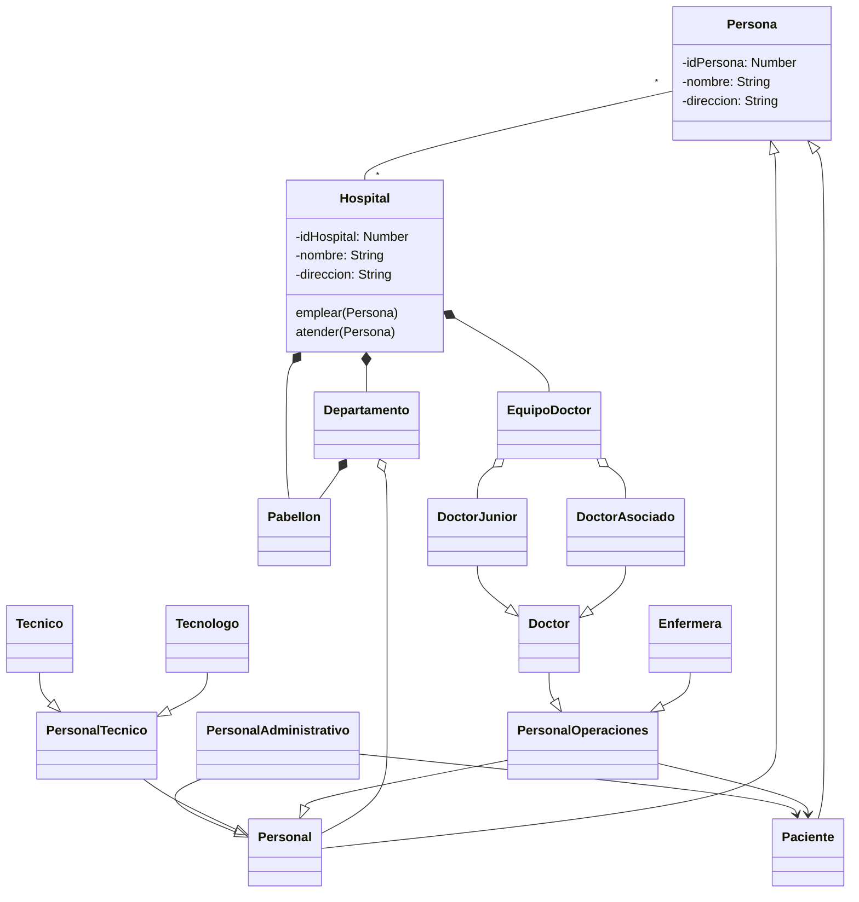

# Ejercicio P.O.O

Se desea diseñar el modelo de dominio para el desarrollo de un Sistema Integrado Hospitalario (SIH) para la cual se tiene el extracto de una conversación realizada con unos de los gerentes hospitalarios:

“[…] Una persona podría estar asociada con diferentes hospitales, y un Hospital podría emplear o atender a múltiples Personas. Las personas tienen atributos derivados como nombre y dirección. Nombre representa el nombre completo y podría combinarse con el título, el nombre de pila, el segundo nombre y apellidos. Los pacientes tienen atributos derivados como la edad que se calcula en función de su fecha de nacimiento y la fecha actual o la fecha de ingreso en el hospital, y son asignados específicamente en un pabellón de acuerdo a su diagnóstico (si hay disponibilidad en la capacidad de dicho pabellón). De igual forma un hospital está compuesto por departamentos a los cuales está vinculado el personal del hospital, de quienes se conoce la fecha de vinculación y su salario. El desarrollo de las principales actividades del hospital es realizado por personal administrativo, técnico (el cual puede ser técnico o de tecnología) y de operaciones (el cual puede ser doctor o enfermera) quienes atienden a los pacientes. Por su parte, los doctores se encuentran organizados en equipos que tiene un líder que debe ser doctores asociados y doctores junior que participan en diagnósticos, aunque no están al cargo de pacientes […]”

# Diagrama De Clases

